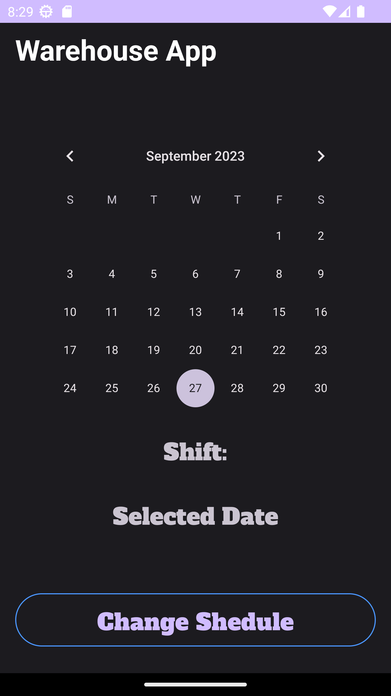
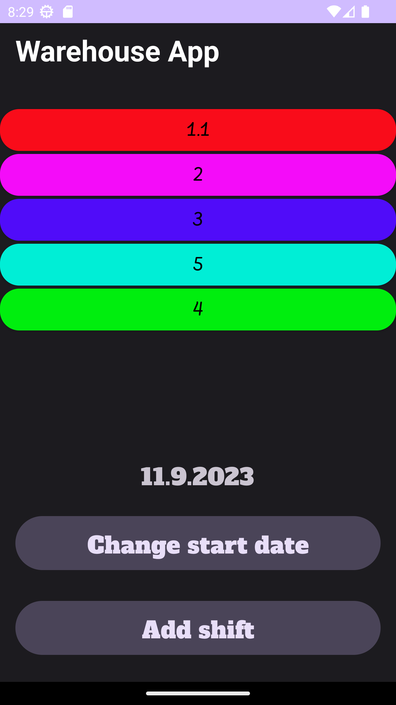
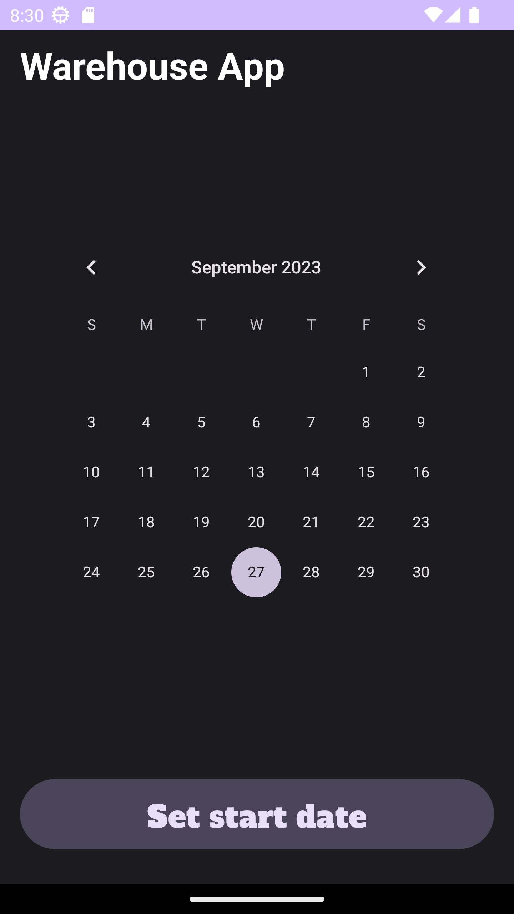
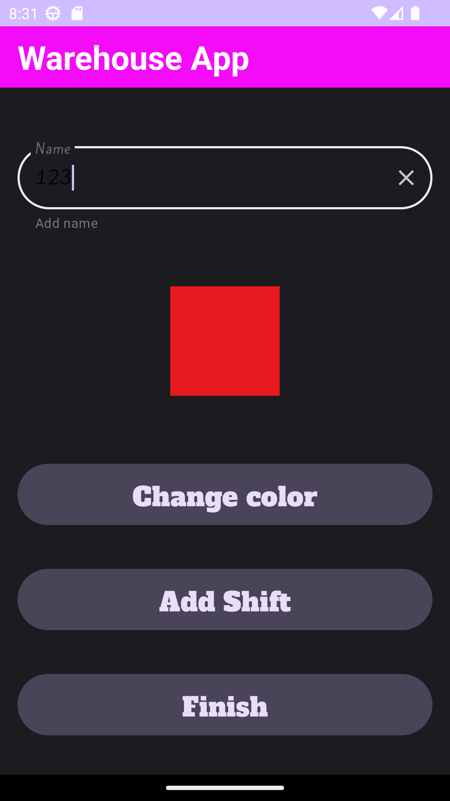
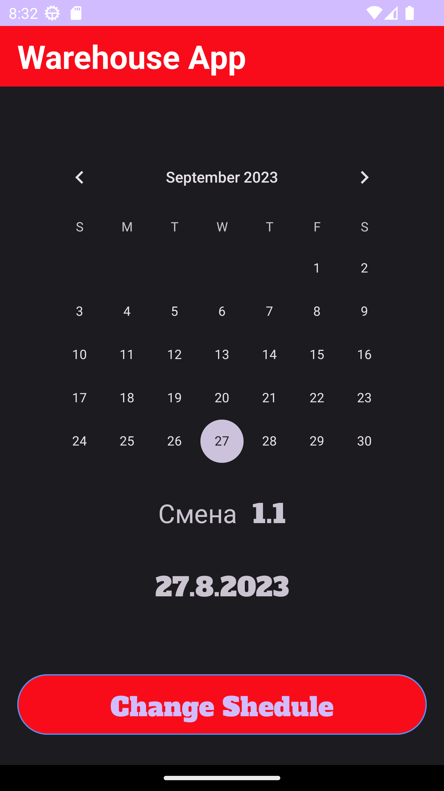
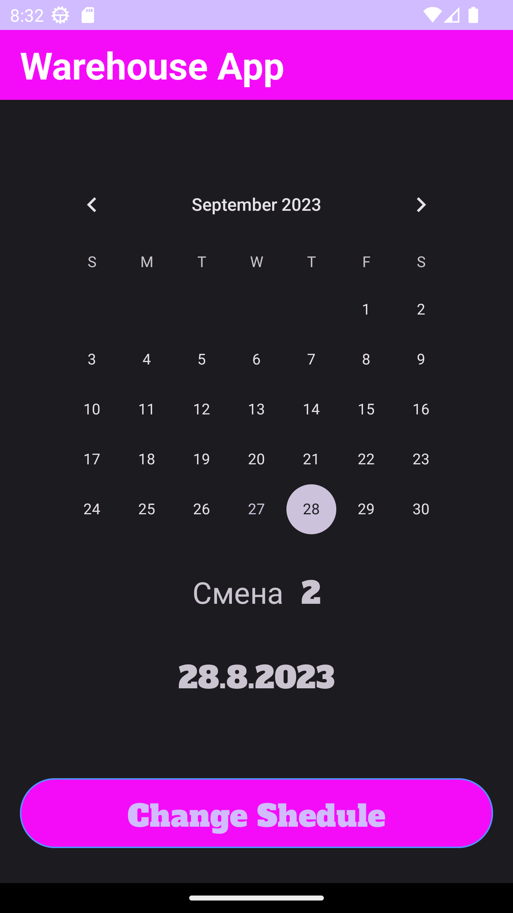

# ShiftsManagementApp

This is a basic shift management app for managmenting your working shifts.
Helps user to create their shedule as a list of working shifts, set the start date of the report and see which shift the user will be working on a particular day.
Written using Kotlin, Room for database, Koin for Dependency Injections, Ambilwarna for picking color dialog.

# Features
- MVVM architecture pattern
- Clean Architecture
- Storing shedule data using Room database
- Used CalendarView to select the date in question

# Gallery

<li>
  Main screen
</li>
<li>
  
</li>
<li>
  Shifts screen
</li>
<li>
  
</li>
<li>
  Set start date screen
</li>
<li>
  
</li>
<li>
  Edit shift
</li>
<li>
  
</li>
<li>
  Test on first date
</li>
<li>
  
</li>
<li>
  Test on second date
</li>
<li>
  
</li>

  
